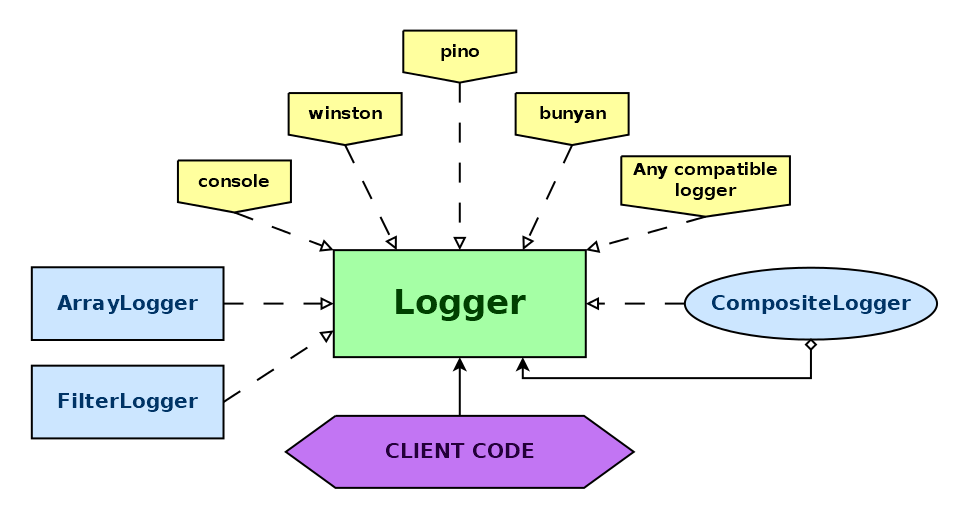

# unified-logging

_Universal, minimalist logging for TypeScript_


[](https://badge.fury.io/js/@giancosta86%2Funified-logging)
[](/LICENSE)



The core of **unified-logging** is the `Logger` interface for **TypeScript**, designed to be used in client code - especially libraries - without depending on a specific logging technology.

Furthermore, this package includes a variety of _utility classes_ that can simplify your logging infrastructure.

## Installation

```bash
npm install @giancosta86/unified-logging
```

or

```bash
yarn add @giancosta86/unified-logging
```

The public API entirely resides in the root package index, so you shouldn't reference specific modules.

## Usage

Just import names from the package index:

```typescript
import {...} from "@giancosta86/unified-logging"
```

### Logger

The `Logger` interface provides just a few core methods:

- `debug(message: string)`

- `info(message: string)`

- `warn(message: string)`

- `error(message: string)`

This is all you need to start working with the library: for example, you might declare a constructor expecting a `Logger` instance among other options - thus letting clients choose the actual implementation.

For example:

```typescript
import { Logger } from "@giancosta86/unified-logging";

function doSomething(logger: Logger): void {
  logger.info("Starting operation...");

  //More code...

  logger.info("Done!");
}

//Console supports the Logger interface!
doSomething(console);
```

### ArrayLogger

Class implementing `Logger` by storing the received messages into `string[]` fields inspectable via read-only properties - for example, `debugMessages`. Especially useful for testing.

### FilterLogger

`Logger` implementation acting as a filter between the client code and another logger; it is based on the `LogLevel` enum, and is especially useful to add filtering to the global `console` object. For example:

```typescript
const filteredConsole = new FilterLogger(console).setLevel(LogLevel.Warn);

//...some code later...

filteredConsole.info("This will not be displayed!");
```

### CompositeLogger

`Logger` implementation that forwards each message to all of its sub-loggers.

## Compatibility

This library is currently tested with:

- the traditional **console** object

- [Pino](https://www.npmjs.com/package/pino)

- [Winston](https://www.npmjs.com/package/winston)

- [Bunyan](https://www.npmjs.com/package/bunyan)

It is because of TypeScript's _structural typing_ that the `Logger` interface actually supports any logger instance providing its methods - with no need for explicit implementation.
